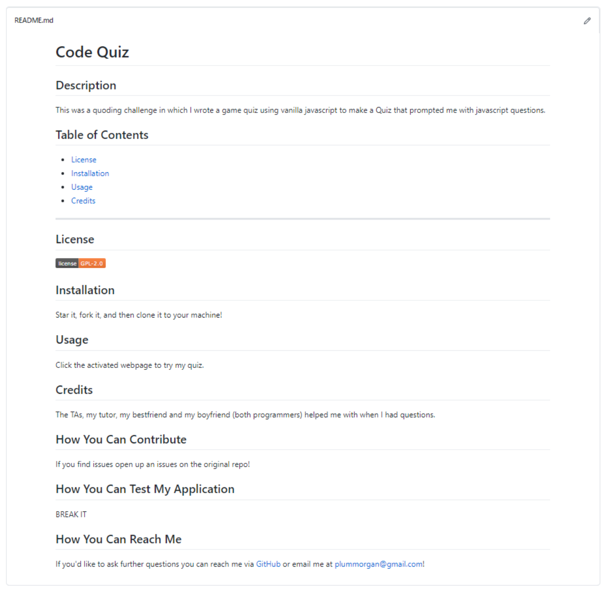

___

# Professional README Generator

## Description

This project was to write code for a READEME generator using Node.js, the npm Inquirer and some rough Markdown knowledge. 


## Table of Contents 

* [License](#license)
* [Installation](#installation)
* [Usage](#usage)
* [Credits](#credits)


## License

[](https://opensource.org/licenses/GPL-2.0)

## Installation 

First star it. 
Then you could either fork it or download a zip file of it.
You should also have Node installed to your machine and the Inquirer npm.

## Usage

Once you have the above all done, you can open up the folder in your code editor of choice, mine is VS Code, and then summon node in your terminal followed immediately by index, like such :

``` node index```

Then follow the question prompt.

And there you go, a markdown file, created just for you!

## Credits

The TAs, and my boyfriend who answered questions I had about arrow functions! 


## How You Can Contribute

If you find issues open up an issues on the original repo!

## How You Can Test My Application

BREAK IT, I dare you.

## How You Can Reach Me

If you'd like to ask further questions you can reach me via [GitHub](https://github.com/cat-lin-morgan/) or email me at plummorgan@gmail.com!

## Video Walk-Thru and Screenshot

#### Video Walk-thru

[Click here to view my walk-thru of the README generator.](https://drive.google.com/file/d/15rRuavutwF-W-ujjjMWMEkmaiwdeEWRs/view?usp=sharing "README Generator")


#### Screenshot


___
